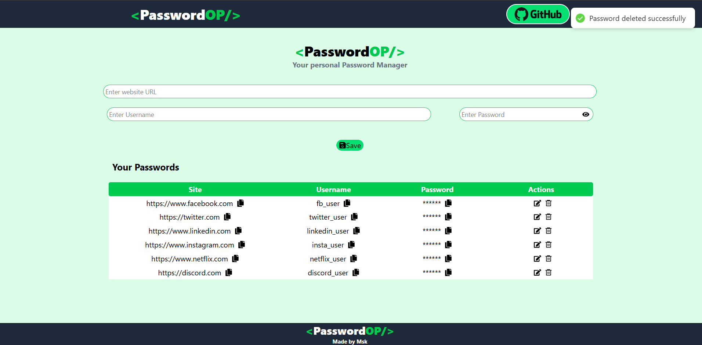
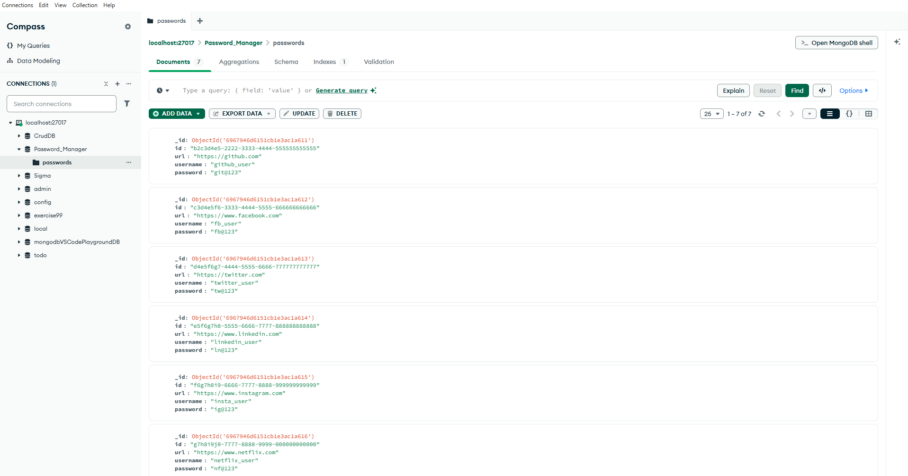

# 🔐 PasswordOP – Password Manager (LocalStorage + Full Stack)

PasswordOP is a **password manager project implemented in two ways**:

1. **LocalStorage Version** – Frontend-only React app using browser localStorage
2. **Full Stack Version** – React frontend with an Express + MongoDB backend

This repository clearly shows the progression from a frontend-only solution to a complete full stack application.

---

## ✨ Features

### Common Features (Both Versions)

* Add website URL, username, and password
* Show / hide password visibility
* Copy URL, username, or password to clipboard
* Edit saved passwords
* Delete passwords with confirmation
* Toast notifications for user actions
* Responsive UI built with Tailwind CSS

### LocalStorage Version

* Frontend-only implementation
* Uses browser `localStorage` for persistence
* No backend or database required
* Works offline

### Full Stack Version

* React frontend
* Express REST API backend
* MongoDB database with Mongoose
* Persistent storage across sessions
* CORS-enabled frontend-backend communication

---

## 🧰 Tech Stack

### Frontend

* React (Vite)
* Tailwind CSS
* react-icons
* react-hot-toast

### Backend

* Node.js
* Express.js
* MongoDB
* Mongoose
* dotenv
* cors

---

## 📂 Repository Structure

```
PASSWORD_MANAGER/
├── backend/
│   ├── model/
│   │   └── password.js              # Mongoose schema
│   ├── .env                         # Environment variables (not committed)
│   ├── package.json
│   ├── package-lock.json
│   ├── server.js                    # Express server entry point
│   └── setup.txt                    # Backend setup notes
│
├── frontend-fullstack/
│   ├── public/
│   ├── src/
│   │   ├── components/
│   │   │   ├── Body.jsx
│   │   │   ├── Footer.jsx
│   │   │   ├── Navbar.jsx
│   │   │   └── PasswordBox.jsx
│   │   ├── App.jsx
│   │   ├── index.css
│   │   └── main.jsx
│   ├── .gitignore
│   ├── eslint.config.js
│   ├── index.html
│   ├── package.json
│   ├── package-lock.json
│   └── vite.config.js
│
├── frontend-localstorage/
│   ├── public/
│   ├── src/
│   │   ├── components/
│   │   │   ├── Body.jsx
│   │   │   ├── Footer.jsx
│   │   │   ├── Navbar.jsx
│   │   │   └── PasswordBox.jsx
│   │   ├── App.jsx
│   │   ├── index.css
│   │   └── main.jsx
│   ├── .gitignore
│   ├── eslint.config.js
│   └── index.html
│
├── .gitignore
└── README.md
```

---

## ⚙️ Setup & Run Instructions

### ▶️ LocalStorage Version

```bash
cd frontend-localstorage
npm install
npm run dev
```

Runs on:

```
http://localhost:5173
```

---

### ▶️ Full Stack Version

#### Backend Setup

```bash
cd backend
npm install
```

Create a `.env` file:

```env
MONGO_URL=mongodb://localhost:27017/
```

Run backend:

```bash
node server.js
```

Backend runs on:

```
http://localhost:3000
```

---

#### Frontend Setup

```bash
cd frontend-fullstack
npm install
npm run dev
```

Frontend runs on:

```
http://localhost:5173
```

---

## 🔄 API Endpoints (Full Stack)

### Get all passwords

```
GET /
```

### Insert password

```
POST /
Headers:
Task: insert
Content-Type: application/json
```

### Delete password

```
POST /
Headers:
Task: delete
Content-Type: application/json
```

---

## 🧠 Data Model

```js
{
  id: String,
  url: String,
  username: String,
  password: String
}
```

---

## 🚀 Future Improvements

* Password encryption (bcrypt / crypto)
* Authentication (JWT / OAuth)
* Search and filtering
* Cloud deployment
* Password strength indicator

---

## 📸 Screenshots






## 👨‍💻 Author

**Mayank Singh**


